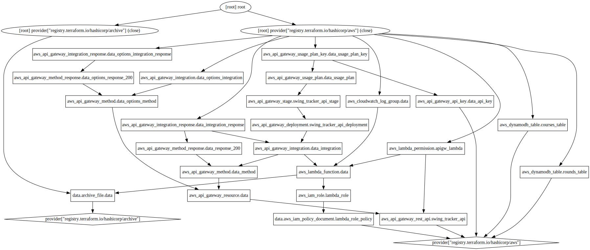

# Golf Round Tracker

A Dockerised React web app to log my rounds of golf, written in TypeScript. All backend code and data is hosted in AWS, created using Terraform.

Data flowing from the frontend passes through an Amazon API Gateway endpoint to AWS Lambda, which then saves the data to Amazon DynamoDB tables.

Component testing done using Jest.

## Technologies Used

* TypeScript
* React
* Jest
* Terraform
* AWS Lambda
* Amazon DynamoDB
* Amazon API Gateway
* Amazon CloudWatch
* Docker

## Terraform Infrasturcture

Output of `terraform graph` command:

